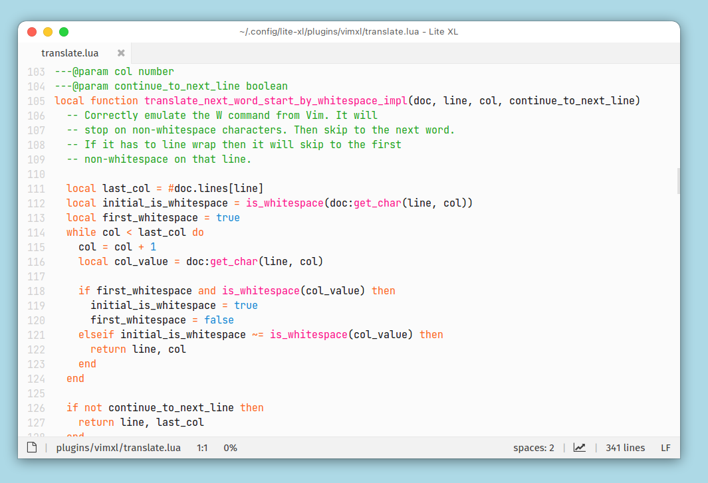

# VimXL




Vim plugin for [Lite XL](https://lite-xl.com/), that hopefully doesn't suck this time!

## 🚀 Installation
Just do 

```sh
git clone https://github.com/sashabjorkman/vimxl
```

inside of your `plugins/` directory.
Which is usually `~/.config/lite-xl/plugins`


## ✨ Features
Here is a non-exhaustive list of features currently implemented:
* The repeat command (`.`)
* Insert mode, visual mode, normal mode, command mode
* Search support
* Yank, delete, change, substitute
* Indent, unindent
* Editing commands (`o`, `O`, `A`, `I`, `p`, `P`)
* Common motions (`w`, `W`, `b`, `B`, `G`, `gg`, `^`, `$`, `_`, `+`, `|`, `f`, `F`, `n`, `N`)
* Classical Vim navigation (`h`, `j`, `k`, `l`)
* Very easily extendable (and build your own plugins on top of)
* Numerical arguments for motions and operators (e.g. `2d3j4.`)
* Easily toggle Vim mode on and off
* A lot of comments.
* ... and more!

### 🚫 Missing Features
If you make heavy use of visual block mode (Ctrl+V)
then VimXL is not quite ready for you yet.
Although much of what you would do with visual block mode
can easily be done through Lite XL's multi-cursor support.
That said, it's understandable if Vim muscle memory makes this a deal-breaker.

## Philosophy
The aim of VimXL is to be as non-intrusive as possible.
And generally to be a good citizen in the Lite XL world.
For example,
the insert mode of VimXL is almost
identical to running Lite XL without any plugins.
Also where possible,
VimXL tries to avoid reimplementing features already present in Lite XL.
VimXL reuses the bundled
[autocomplete.lua](https://github.com/lite-xl/lite-xl/blob/e8ecf9c40dc41f457543c799470cc85369a0ccf6/data/plugins/autocomplete.lua)
plugin.
Motions in VimXL are implemented as ordinary Lite XL translations.

Furthermore the goal is to only implement a subset
of the vast collection of Vim commands and motions.
More specifically, only the ones that I use, or that are requested by others.
However if a command is added to this plugin,
then a lot of care and effort should go into making sure that the command
correctly mimics the exact behaviour of its Vim counterpart.
For example,
even though VimXL does not currently support paragraph text objects,
its implementation of the delete word command is to my knowledge correct.
Try running `2d2w3.` in VimXL and compare the result to other plugins.
The correct behaviour (that can be seen by doing the same in Vim) is that
a total of 7 words should be deleted.

## ⚠️ Bugs and Inconsistencies
If you find a bug or any implementation
inconsistencies between VimXL and stock Vim,
please feel free to create an issue or contact
me through the official Lite XL community.
I am very interested in resolving these.
As for feature requests, I only implement features that people actually use.
Meaning that if something is missing and it is annoying you to the degree
that you are unable to use VimXL without this feature,
then I am also interested in hearing about your case.
Keep in mind however that this plugin has
the sole goal of implementing stock Vim features.
Any plugins, rare flags/options or the like are out
of scope and should be implemented in another repository.
There are plans for a plugin that builds upon VimXL with
much bigger ambitions that provides an experience more akin to
[DOOM Emacs](https://github.com/doomemacs/doomemacs)
or other famous emacs/neovim config files.
The only exception to this is the *which-key.el* plugin.
I might at some point get around to implementing something like it.
Of course it will be an optionally loaded Lua file.

Currently there might be a few kinks that need to be worked out.
Expect usability to increase rapidly as I keep dogfooding this plugin myself
over the coming days. Apologies for any inconveniences in the meantime.
